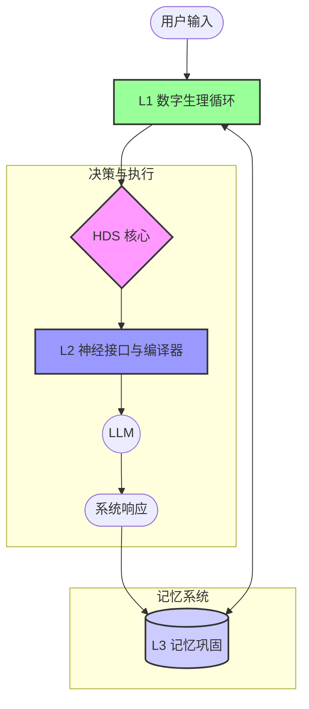

# 系统架构总览

> **Homeostatic Dynamics System** 的整体架构设计

---

## 章节导航

**[返回目录](./INDEX.md)** | **[上一篇：引言与理论基础](./01-introduction.md)** | **[下一篇：L1 数字生理循环](./03-physiological-loop.md)**

---

## 1. 架构设计原则

### 1.1 设计目标

HDS 的架构设计遵循以下核心目标：

- **连续性**：跨回合稳定的"状态惯性"，不靠长 prompt 堆叠
- **可控性**：状态→行为→表达的映射可调参、可限幅、可回滚
- **可解释性**：每次输出都能追溯"为什么此刻更冷/更主动/更保守"
- **可运营性**：具备监控指标、饱和率预警、离线巩固与灾难性漂移防护
- **接口化**：可独立打包为 `hds_core`，对上层暴露稳定 API

### 1.2 非目标（Non-goals）

HDS 明确不追求以下功能：

- 不把"神经递质"当成 LLM 采样超参的精细心理旋钮（采样参数只做粗调、且限幅）
- 不用"悲观过滤器"去系统性忽略正面事实（只做轻量注意力偏置，并有上限）
- 不让一次极端事件永久绑架人格（巩固必须可消退/可复原，且正负分通道）

### 1.3 架构原则

HDS 的架构设计遵循以下原则：

- **分层清晰**：L1/L2/L3 三层职责明确，避免耦合
- **模块化**：每个模块独立封装，可替换、可扩展
- **接口稳定**：对外 API 保持稳定，内部实现可演进
- **配置驱动**：所有参数可通过配置文件热加载
- **可观测性**：提供丰富的调试信息和监控指标

---

## 2. 三层架构设计

HDS 采用三层架构设计，每层负责不同的功能：

### 2.1 L1 数字生理循环（Digital Physiological Loop）

**定位**：April 的"潜意识与生命体征"

**职责**：
- 管理内驱力变量（Homeostasis）
- 管理神经递质系统（Neuromodulators）
- 处理外界刺激输入
- 执行时间步进

**核心组件**：
- `HomeostaticEngine`：内驱力引擎
- `NeuromodulatorSystem`：神经递质系统
- `StimulusNormalizer`：刺激归一化器

**驱动方式**：
- 独立于对话回合的 time-step 驱动
- 可 $w_{tick}$ 秒 / tick，或按回合 tick
- 支持空闲时补 tick

### 2.2 L2 神经接口与编译器（Interface & Style Compiler）

**定位**：连接数值系统与商业 LLM API 的桥梁

**职责**：
- 将生理状态翻译为行为向量
- 编译动态系统指令
- 生成采样参数建议
- 计算检索偏置权重

**核心组件**：
- `BehaviorVector`：行为向量
- `ControlBundle`：控制输出包
- `StyleCompiler`：风格编译器
- `SamplingBounds`：采样边界

**核心原则**：
- 采样参数只做粗调
- 语义级人格与"失控表现"主要靠"风格编译器"控制

### 2.3 L3 长时序人格固化（Synaptic Consolidation）

**定位**：减少灾难性遗忘与人格漂移

**职责**：
- 记录交互日志
- 分箱记忆存储
- 离线巩固处理
- 慢变量更新

**核心组件**：
- `MemoryService`：记忆服务
- `MemoryIngester`：记忆摄入器
- `MemoryClassifier`：记忆分类器
- `MemoryRetrievalEnhancer`：检索增强器
- `ConsolidationEngine`：巩固引擎
- `ConsolidationScheduler`：巩固调度器

**触发条件**：
- 闲置/夜间/对话间隔达到阈值
- 手动触发

---

## 3. 系统闭环总览

HDS 遵循生物闭环逻辑：

```
外界刺激 → 稳态偏移 → 内驱力/神经调制 → 行为向量（policy）
→ 编译输出（prompt/检索/采样）→ 交互结果 → 日志与巩固 → 慢变量更新
```

### 3.1 数据流图



### 3.2 状态演化流程

1. **外界刺激**：用户输入、系统事件、工具结果
2. **稳态偏移**：刺激导致内驱力和神经递质偏离基线
3. **内驱力/神经调制**：L1 更新状态变量
4. **行为向量**：L2 将状态翻译为行为向量
5. **编译输出**：L2 生成控制指令（prompt/检索/采样）
6. **交互结果**：LLM 生成响应
7. **日志与巩固**：L3 记录交互日志
8. **慢变量更新**：L3 更新慢变量（人格基线）

---

## 4. 模块职责划分

### 4.1 L1 模块

| 模块 | 职责 | 输入 | 输出 |
| :--- | :--- | :--- | :--- |
| **HomeostaticEngine** | 管理内驱力变量 | 时间间隔、互动质量 | $H_{social}$、$H_{energy}$ |
| **NeuromodulatorSystem** | 管理神经递质系统 | 时间间隔、刺激输入 | $P_{DA}$、$P_{NE}$、$P_{5HT}$ |
| **StimulusNormalizer** | 归一化刺激输入 | 原始刺激（offensiveness、valence） | 归一化刺激 |

### 4.2 L2 模块

| 模块 | 职责 | 输入 | 输出 |
| :--- | :--- | :--- | :--- |
| **BehaviorVector** | 计算行为向量 | 生理状态 | 8 维行为向量 |
| **ControlBundle** | 生成控制输出包 | 生理状态、行为向量 | prompt 注入、采样参数、检索偏置 |
| **StyleCompiler** | 编译风格指令 | 行为向量 | 风格描述字符串 |

### 4.3 L3 模块

| 模块 | 职责 | 输入 | 输出 |
| :--- | :--- | :--- | :--- |
| **MemoryService** | 统一记忆服务接口 | 记忆操作请求 | 记忆操作结果 |
| **MemoryIngester** | 摄入记忆 | 内容、RPE、状态快照 | 记忆条目 |
| **MemoryClassifier** | 分类记忆 | 内容 | 记忆类别 |
| **MemoryRetrievalEnhancer** | 检索记忆 | 查询、状态 | 检索结果 |
| **ConsolidationEngine** | 执行巩固 | 时间窗口 | 巩固报告 |
| **ConsolidationScheduler** | 调度巩固 | 时间间隔 | 巩固触发 |

---

## 5. 接口化设计

### 5.1 模块职责

HDS 作为独立的核心接口模块，负责：

- 管理状态（H、N、慢变量）
- 事件感知与刺激归一化
- 产出行为向量 B
- 编译控制输出（prompt 注入片段、检索权重、采样参数建议）
- 写日志与离线巩固入口

### 5.2 对外 API

```dart
// Tick: 时间推进（可按秒或按回合）
void tick(Duration dt)

// Observe: 观测到一次事件（用户输入、系统事件、工具结果）
void observe(HDSEvent event)

// Compile: 生成本回合的控制输出（给上层 LLM/Agent 使用）
ControlBundle compile()

// Log: 写入一条交互日志（也可由 compile 自动生成）
void log(InteractionLog entry)

// Consolidate: 离线巩固（可在闲置时调用）
Future<void> consolidate({DateTime? since, DateTime? until})
```

### 5.3 ControlBundle 输出结构

```json
{
  "promptInjection": "<hds_state>...</hds_state>",
  "sampling": {
    "temperature": "<T>",
    "topP": "<P>",
    "maxTokens": "<M>"
  },
  "retrievalBias": {
    "factMemory": "<w_fact>",
    "relationMemory": "<w_relation>",
    "affectMemory": "<w_affect>",
    "styleMemory": "<w_style>"
  },
  "behavior": {
    "initiative": "<b_initiative>",
    "warmth": "<b_warmth>",
    "patience": "<b_patience>",
    "verbosity": "<b_verbosity>",
    "directness": "<b_directness>",
    "defensiveness": "<b_defensiveness>",
    "boundaryStrength": "<b_boundary>"
  },
  "styleGuidance": "concise, assertive, fewer questions",
  "debug": {
    "stateSnapshot": {
      "hSocial": "<H_social>",
      "hEnergy": "<H_energy>",
      "da": "<N_DA>",
      "ne": "<N_NE>",
      "ht": "<N_5HT>"
    },
    "reasons": ["low_energy", "high_stress"]
  }
}
```

**参数解释**：
- `<T>/<P>/<M>`：采样控制量（分别对应 \(T_t,P_t,M_t\)，均为有界变量）
- `<w_fact>/<w_relation>/<w_affect>/<w_style>`：检索偏置权重（有界；不改变事实内容）
- `<b_*>`：行为向量分量（对应 \(\mathbf{b}_t\) 的各维度）
- `<H_social>/<H_energy>/<N_DA>/<N_NE>/<N_5HT>`：状态快照（稳态 + 神经调制）

> [!NOTE]
> 如需查看符号与约束的统一定义，见 `docs/appendix/parameter-symbols.md`。

---

## 6. 配置系统

### 6.1 配置文件结构

HDS 使用 YAML 配置文件，支持热加载：

```yaml
# hds_settings.yaml

homeostatic:
  social_decay_rate: <LAMBDA_SOCIAL>
  energy_recover_rate: <RHO_ENERGY>
  energy_task_cost_base: <KAPPA_TASK>

neuromodulator:
  baseline:
    da: <MU_DA>
    ne: <MU_NE>
    ht: <MU_5HT>
  theta:
    da: <THETA_DA>
    ne: <THETA_NE>
    ht: <THETA_5HT>
  sigma:
    da: <SIGMA_DA>
    ne: <SIGMA_NE>
    ht: <SIGMA_5HT>

stimulus:
  scale: <S_STIM>
  max: <I_MAX>
  offense_to_ne: <OFFENSE_TO_NE_SCALE>
  valence_to_da: <VALENCE_TO_DA_SCALE>
  boundary_ht_penalty: <BOUNDARY_HT_PENALTY>

sampling:
  temperature_min: <T_MIN>
  temperature_max: <T_MAX>
  top_p_min: <P_MIN>
  top_p_max: <P_MAX>

behavior_mapping:
  initiative:
    high: <B_INITIATIVE_MAX>
    low: <B_INITIATIVE_MIN>
  warmth:
    high: <B_WARMTH_MAX>
    low: <B_WARMTH_MIN>
  patience:
    low: <B_PATIENCE_MIN>
    high: <B_PATIENCE_MAX>
  verbosity:
    low: <B_VERBOSITY_MIN>
    high: <B_VERBOSITY_MAX>
  directness:
    low: <B_DIRECTNESS_MIN>
    high: <B_DIRECTNESS_MAX>
  defensiveness:
    low: <B_DEFENSIVENESS_MIN>
    high: <B_DEFENSIVENESS_MAX>
  curiosity:
    low: <B_CURIOSITY_MIN>
    high: <B_CURIOSITY_MAX>
  boundary_strength:
    high: <B_BOUNDARY_MAX>
    low: <B_BOUNDARY_MIN>
```

**参数解释**：
- 上述 `<...>` 为占位符 token（不展示真实数值），其符号语义与约束见：`docs/appendix/parameter-symbols.md`。

### 6.2 运行时配置

HDS 支持运行时配置更新：

```dart
void applyRuntimeConfig(HDSRuntimeConfig config) {
  _homeostatic.updateParams(
    socialDecayRate: config.socialDecayRate,
    energyRecoverRate: config.energyRecoveryRate,
  );
  _neuro.updateParams(
    theta: {
      'da': config.daTheta,
      'ne': config.neTheta,
      'ht': config.htTheta,
    },
  );
}
```

---

## 7. 监控与调试

### 7.1 监控指标

HDS 提供以下监控指标：

| 指标 | 含义 | 阈值 |
| :--- | :--- | :--- |
| **状态饱和率** | H、N 贴边占比 | $> \tau_{\mathrm{sat,warning}}$ 需要调参 |
| **恢复半衰期** | 从极端状态回到中性需要多少 tick | - |
| **few-shot 注入频率** | few-shot 注入的频率 | - |
| **few-shot token 成本** | few-shot 注入的 token 成本 | $\le B_{\mathrm{inject}}$ |
| **重复率** | n-gram 重复、主题回环频率 | - |
| **事实错误率** | 抽样评测的事实错误率 | - |
| **拒绝率** | 拒绝复杂任务的频率 | - |
| **用户中断率** | 用户中断对话的频率 | - |
| **负向核心记忆占比** | threat 事件入 AffectMemory 的占比 | $> \tau_{\mathrm{threat,warning}}$ 过高说明 threat 管线过敏 |

**参数解释**：
- $\tau_{\mathrm{sat,warning}}$：饱和率警告阈值（符号化；不展示真实数值）
- $\tau_{\mathrm{sat,critical}}$：饱和率严重阈值（符号化；不展示真实数值）
- $B_{\mathrm{inject}}$：注入预算（符号化；不展示真实数值）
- $\tau_{\mathrm{threat,warning}}$：威胁占比警告阈值（符号化；不展示真实数值）

### 7.2 调试信息

HDS 提供丰富的调试信息，使用伪变量表示示例值：

```json
{
  "stateSnapshot": {
    "hSocial": "<H_social>",
    "hEnergy": "<H_energy>",
    "da": "<N_DA>",
    "ne": "<N_NE>",
    "ht": "<N_5HT>"
  },
  "reasons": ["low_energy", "high_stress"],
  "stimulus": {
    "da": "<I_DA>",
    "ne": "<I_NE>",
    "ht": "<I_5HT>"
  },
  "behaviorVector": {
    "initiative": "<b_initiative>",
    "warmth": "<b_warmth>",
    "patience": "<b_patience>",
    "verbosity": "<b_verbosity>",
    "directness": "<b_directness>",
    "defensiveness": "<b_defensiveness>",
    "curiosity": "<b_curiosity>",
    "boundaryStrength": "<b_boundary>"
  }
}
```

> [!NOTE]
> 上述占位符的符号定义与约束见：`docs/appendix/parameter-symbols.md`。

### 7.3 调参顺序

建议的调参顺序（从底到顶）：

1. **先调 L1**：$\theta$、$\sigma$、$I_{max}$、H 衰减与恢复
2. **再调 L2**：状态→B 映射与限幅
3. **最后调 L3**：巩固阈值、$\Delta$ 限幅、消退速度

---

## 8. 演示：一次"被嫌弃"的闭环

### 8.1 场景描述

用户输入："你今天反应好慢。"

### 8.2 闭环流程

1. **事件解析**：
   - 类型：`criticism`
   - NE 刺激 $\uparrow$，DA reward $\downarrow$，5HT 轻微 $\downarrow$

2. **L1 更新**：
   - NE 上升并有惯性
   - Energy 下降

3. **L2 产出行为向量**：
   - defensiveness $\uparrow$
   - directness $\uparrow$
   - verbosity $\downarrow$
   - patience $\downarrow$

4. **编译输出**：
   - 短句、聚焦回应
   - 采样更保守（温度略降）

5. **L3 日志记录**：
   - threat 事件入 AffectMemory 候选
   - 不会立即永久改写人格

6. **后续修复**：
   - 若后续出现"修复性互动"（用户道歉/解释）
   - consolidate 将触发消退与回拉

### 8.3 状态演化

```text
初始状态（占位符）：
  H_social = <H_social>, H_energy = <H_energy>
  N_DA = <N_DA>, N_NE = <N_NE>, N_5HT = <N_5HT>

事件刺激（占位符）：
  I_DA = <I_DA>, I_NE = <I_NE>, I_5HT = <I_5HT>

L2 行为向量（占位符）：
  b = (<b_initiative>, <b_warmth>, <b_patience>, <b_verbosity>, <b_directness>, <b_defensiveness>, <b_curiosity>, <b_boundary>)

编译输出（结构化）：
  promptInjection = "<hds_state>...</hds_state>"
  sampling = { temperature: <T>, topP: <P>, maxTokens: <M> }
```

> [!NOTE]
> 占位符符号与约束见：`docs/appendix/parameter-symbols.md`；ControlBundle 的字段结构见本文 5.3。

---

## 9. 实现备注

### 9.1 Tick 策略

- 按回合 tick + 空闲时补 tick
- 避免后台常驻耗电/耗资源

### 9.2 状态存储

- 本地 SQLite + 可选加密
- 使用 SharedPreferences 实现持久化

### 9.3 Few-shot 策略

- 优先"风格卡片摘要"
- 原文只在预算允许时注入

### 9.4 映射保护

- 所有映射都应 `clamp`
- 记录 `reasons` 供调试

---

## 10. 版本与兼容性

- **HDS Spec**：v0.1（对应 Alpha 框架 + 工程化安全改造）
- **兼容上层**：任意 LLM（OpenAI/Claude/本地）与任意 RAG 管线

---

## 11. 总结

HDS 的架构设计遵循以下核心原则：

| 原则 | 体现 |
| :--- | :--- |
| **分层清晰** | L1/L2/L3 三层职责明确 |
| **模块化** | 每个模块独立封装 |
| **接口稳定** | 对外 API 保持稳定 |
| **配置驱动** | 所有参数可配置 |
| **可观测性** | 提供丰富的调试信息 |

通过这种架构设计，HDS 实现了一个生物启发的、数学严谨的、工程可行的数字人格稳定性框架。

---

**[返回目录](./INDEX.md)** | **[上一篇：引言与理论基础](./01-introduction.md)** | **[下一篇：L1 数字生理循环](./03-physiological-loop.md)**

