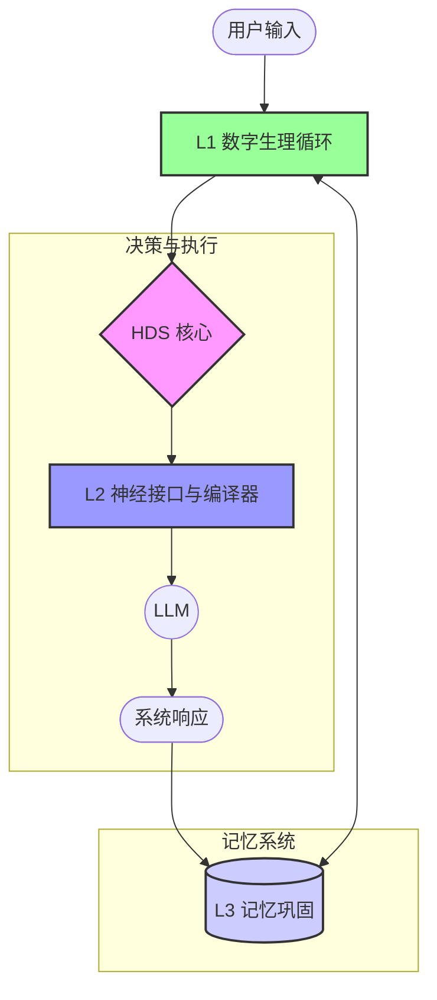

**[返回目录](../INDEX.md)** | **[返回本章](./README.md)** | **[上一节](./02.md)** | **[下一节](./04.md)**

# 02.3 系统闭环总览
HDS 遵循生物闭环逻辑：

```
外界刺激 → 稳态偏移 → 内驱力/神经调制 → 行为向量（policy）
→ 编译输出（prompt/检索/采样）→ 交互结果 → 日志与巩固 → 慢变量更新
```

### 3.1 数据流图



### 3.2 状态演化流程

1. **外界刺激**：用户输入、系统事件、工具结果
2. **稳态偏移**：刺激导致内驱力和神经递质偏离基线
3. **内驱力/神经调制**：L1 更新状态变量
4. **行为向量**：L2 将状态翻译为行为向量
5. **编译输出**：L2 生成控制指令（prompt/检索/采样）
6. **交互结果**：LLM 生成响应
7. **日志与巩固**：L3 记录交互日志
8. **慢变量更新**：L3 更新慢变量（人格基线）

---

**[返回目录](../INDEX.md)** | **[返回本章](./README.md)** | **[上一节](./02.md)** | **[下一节](./04.md)**
