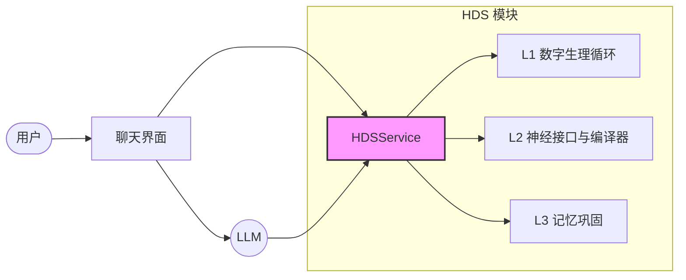

# 应用场景

> **Homeostatic Dynamics System** 的实际应用场景

---

## 章节导航

**[返回目录](./INDEX.md)** | **[上一篇：实现指南](./07-implementation-guide.md)** | **[下一篇：返回主页](../README.md)**

---

## 1. 概述

### 1.1 应用目标

HDS 可作为可插拔的"大脑接口模块"，为上层对话代理（LLM）输出可控、可解释、可监控的行为调度信号。

### 1.2 核心应用场景

HDS 的核心应用场景包括：

- 对话系统集成
- 人格稳定性控制
- 可解释性分析
- 扩展应用

---

## 2. 对话系统集成

### 2.1 系统架构

#### 2.1.1 集成架构图

#### 2.1.2 数据流

1. 用户输入 → 聊天界面
2. 聊天界面 → HDS.observe()
3. HDS → L1 更新状态
4. HDS → L2 编译控制输出
5. HDS → LLM（控制输出）
6. LLM → 生成响应
7. 响应 → 用户
8. HDS → L3 记录日志

### 2.2 动态调节对话

#### 2.2.1 语气调节

HDS 根据当前状态动态调节对话语气：

| 状态 | 语气 | 表现 |
| :--- | :--- | :--- |
| $H_{social} < w_{social\_low}$ | 温暖、主动 | 更愿意展开话题、更主动提问 |
| $H_{social} > w_{social\_high}$ | 冷淡、独立 | 更简洁回应、更少主动 |
| $H_{energy} < w_{energy\_low}$ | 简洁、直接 | 更短回应、更少解释 |
| $H_{energy} > w_{energy\_high}$ | 详细、耐心 | 更长回应、更多解释 |
| $P_{NE} > w_{ne\_high}$ | 警觉、防御 | 更谨慎表达、更多边界 |
| $P_{NE} < w_{ne\_low}$ | 放松、开放 | 更随意表达、更少边界 |

**参数解释**：
- $w_{social\_low}$：社交饱腹感低阈值，默认值 $w_{w_{sl}}$
- $w_{social\_high}$：社交饱腹感高阈值，默认值 $w_{w_{sh}}$
- $w_{energy\_low}$：认知能量低阈值，默认值 $w_{w_{el}}$
- $w_{energy\_high}$：认知能量高阈值，默认值 $w_{w_{eh}}$
- $w_{ne\_low}$：去甲肾上腺素低阈值，默认值 $w_{w_{nl}}$
- $w_{ne\_high}$：去甲肾上腺素高阈值，默认值 $w_{w_{nh}}$

#### 2.2.2 节奏调节

HDS 根据当前状态动态调节对话节奏：

| 状态 | 节奏 | 表现 |
| :--- | :--- | :--- |
| $P_{DA} > w_{da\_high}$ | 快节奏 | 更快回应、更多话题切换 |
| $P_{DA} < w_{da\_low}$ | 慢节奏 | 更慢回应、更少话题切换 |
| $H_{energy} > w_{energy\_high}$ | 持续节奏 | 更稳定回应、更少中断 |
| $H_{energy} < w_{energy\_low}$ | 间歇节奏 | 更不规律回应、更多中断 |

**参数解释**：
- $w_{da\_high}$：多巴胺高阈值，默认值 $w_{w_{dh}}$
- $w_{da\_low}$：多巴胺低阈值，默认值 $w_{w_{dl}}$
- $w_{energy\_high}$：认知能量高阈值，默认值 $w_{w_{eh}}$
- $w_{energy\_low}$：认知能量低阈值，默认值 $w_{w_{el}}$

#### 2.2.3 深度调节

HDS 根据当前状态动态调节对话深度：

| 状态 | 深度 | 表现 |
| :--- | :--- | :--- |
| $H_{energy} > w_{energy\_high}$ | 深度对话 | 更详细解释、更多分析 |
| $H_{energy} < w_{energy\_low}$ | 浅层对话 | 更简洁回应、更少分析 |
| $P_{5HT} > w_{5ht\_high}$ | 结构化对话 | 更有条理、更多逻辑 |
| $P_{5HT} < w_{5ht\_low}$ | 自由对话 | 更随意、更多联想 |

**参数解释**：
- $w_{energy\_high}$：认知能量高阈值，默认值 $w_{w_{eh}}$
- $w_{energy\_low}$：认知能量低阈值，默认值 $w_{w_{el}}$
- $w_{5ht\_high}$：血清素高阈值，默认值 $w_{w_{5hh}}$
- $w_{5ht\_low}$：血清素低阈值，默认值 $w_{w_{5hl}}$

### 2.3 用户情绪感知

#### 2.3.1 情绪识别

HDS 通过感知模块识别用户情绪：

| 情绪类型 | 触发条件 | 检测方法 |
| :--- | :--- | :--- |
| positive | 情感分数 > $w_{sentiment\_pos}$ | 情感分析 |
| neutral | 情感分数 ∈ [$w_{sentiment\_neg}$, $w_{sentiment\_pos}$] | 情感分析 |
| negative | 情感分数 < $w_{sentiment\_neg}$ | 情感分析 |
| angry | 关键词匹配 | 关键词提取 |
| sad | 关键词匹配 | 关键词提取 |
| fearful | 关键词匹配 | 关键词提取 |
| surprised | 情感分数突变 | 情感分析 |

**参数解释**：
- $w_{sentiment\_pos}$：情感正阈值，默认值 $w_{w_{sp}}$
- $w_{sentiment\_neg}$：情感负阈值，默认值 $w_{w_{sn}}$

#### 2.3.2 情绪响应

HDS 根据用户情绪调整响应策略：

| 用户情绪 | HDS 响应策略 |
| :--- | :--- |
| positive | 提升温暖度、主动性 |
| neutral | 保持当前状态 |
| negative | 提升防御性、边界力度 |
| angry | 提升防御性、降低主动性 |
| sad | 提升温暖度、降低防御性 |
| fearful | 提升防御性、降低主动性 |
| surprised | 提升好奇心、降低防御性 |

---

## 3. 人格稳定性控制

### 3.1 人格突变防护

#### 3.1.1 状态惯性

HDS 通过状态惯性避免人格突变：

$$
X_{t+\Delta t} = X_t + \theta(\mu - X_t)\Delta t
$$

其中：
- $\theta$：回归速率，控制状态变化速度
- $\mu$：基线水平，反映人格特质

**效果**：
- 短期波动不会导致人格突变
- 长期趋势会逐渐反映在人格中

#### 3.1.2 限幅保护

HDS 通过限幅保护避免极端行为：

$$
X_{clamped} = \text{clamp}(X_{raw}, X_{min}, X_{max})
$$

其中：
- $X_{raw}$：原始值
- $X_{min}$：下限
- $X_{max}$：上限

**效果**：
- 防止极端值导致极端行为
- 保证行为在可控范围内

### 3.2 渐进式人格演化

#### 3.2.1 慢变量更新

HDS 通过慢变量更新实现渐进式人格演化：

$$
\mu_{t+1} = \mu_t + \Delta \mu, \quad |\Delta \mu| \le \Delta_{max}
$$

其中：
- $\Delta_{max}$：单次更新最大幅度

**效果**：
- 人格变化缓慢且可控
- 避免单次事件导致人格突变

#### 3.2.2 消退机制

HDS 通过消退机制实现人格可复原：

$$
\Delta \mu_{extinction} = -w_{extinction\_rate} \cdot \Delta \mu
$$

其中：
- $w_{extinction\_rate}$：消退速率

**效果**：
- 后续正向证据可以回拉人格
- 避免负向事件永久绑架人格

### 3.3 人格参数调优

#### 3.3.1 参数调优流程

参数调优流程：

1. **收集数据**：记录对话日志、用户反馈
2. **分析指标**：计算状态饱和率、恢复半衰期等
3. **调整参数**：根据指标调整 $\theta$、$\sigma$、$\mu$ 等
4. **验证效果**：观察调整后的效果
5. **迭代优化**：重复上述流程

#### 3.3.2 参数调优示例

**问题**：系统过于保守，主动性不足

**分析**：
- $b_1$（主动性）长期偏低
- $H_{social}$ 长期偏高
- $\mu_{DA}$ 偏低

**调整**：
- 提高 $b_{1,high}$：从 $w_{b_{1h}}$ 提高到 $w_{b_{1h}} + w_{adjust\_small}$
- 降低 $d_s$：从 $w_{d_s}$ 降低到 $w_{d_s} - w_{adjust\_tiny}$
- 提高 $\mu_{DA}$：从 $w_{\mu_{DA}}$ 提高到 $w_{\mu_{DA}} + w_{adjust\_small}$

**验证**：
- 观察 $b_1$ 是否提高
- 观察 $H_{social}$ 是否降低
- 观察用户反馈是否改善

**参数解释**：
- $w_{adjust\_small}$：小调整值，默认值 $w_{w_{as}}$
- $w_{adjust\_tiny}$：微小调整值，默认值 $w_{w_{at}}$

---

## 4. 可解释性分析

### 4.1 决策追溯

#### 4.1.1 状态快照

HDS 提供完整的状态快照：

| 字段 | 类型 | 说明 |
| :--- | :--- | :--- |
| `hSocial` | Number | 社交饱腹感 |
| `hEnergy` | Number | 认知能量 |
| `da` | Number | 多巴胺水平 |
| `ne` | Number | 去甲肾上腺素水平 |
| `ht` | Number | 血清素水平 |

#### 4.1.2 决策理由

HDS 提供决策理由，使用伪变量表示阈值：

| 理由 | 触发条件 | 影响 |
| :--- | :--- | :--- |
| low_energy | $H_{energy} < w_{energy\_low}$ | 降低耐心度、话量 |
| high_stress | $P_{NE} > w_{ne\_high}$ | 提升防御性、直率 |
| low_motivation | $P_{DA} < w_{da\_low}$ | 降低好奇心、主动性 |
| high_social | $H_{social} > w_{social\_high}$ | 降低主动性、温暖度 |

**参数解释**：
- $w_{energy\_low}$：能量低阈值，默认值 $w_{w_{el}}$
- $w_{ne\_high}$：去甲肾上腺素高阈值，默认值 $w_{w_{nh}}$
- $w_{da\_low}$：多巴胺低阈值，默认值 $w_{w_{dl}}$
- $w_{social\_high}$：社交饱腹感高阈值，默认值 $w_{w_{sh}}$

### 4.2 人格演化监控

#### 4.2.1 状态演化轨迹

HDS 记录状态演化轨迹，使用伪变量表示示例值：

| 时间戳 | $H_{social}$ | $H_{energy}$ | $P_{DA}$ | $P_{NE}$ | $P_{5HT}$ |
| :--- | :--- | :--- | :--- | :--- | :--- |
| $T_0$ | $w_{h\_s0}$ | $w_{h\_e0}$ | $w_{p\_d0}$ | $w_{p\_n0}$ | $w_{p\_h0}$ |
| $T_1$ | $w_{h\_s1}$ | $w_{h\_e1}$ | $w_{p\_d1}$ | $w_{p\_n1}$ | $w_{p\_h1}$ |
| $T_2$ | $w_{h\_s2}$ | $w_{h\_e2}$ | $w_{p\_d2}$ | $w_{p\_n2}$ | $w_{p\_h2}$ |

**参数解释**：
- $w_{h\_s0}$、$w_{h\_s1}$、$w_{h\_s2}$：社交饱腹感示例值
- $w_{h\_e0}$、$w_{h\_e1}$、$w_{h\_e2}$：认知能量示例值
- $w_{p\_d0}$、$w_{p\_d1}$、$w_{p\_d2}$：多巴胺示例值
- $w_{p\_n0}$、$w_{p\_n1}$、$w_{p\_n2}$：去甲肾上腺素示例值
- $w_{p\_h0}$、$w_{p\_h1}$、$w_{p\_h2}$：血清素示例值

#### 4.2.2 慢变量演化

HDS 记录慢变量演化：

| 时间戳 | $\mu_{DA}$ | $\mu_{NE}$ | $\mu_{5HT}$ |
| :--- | :--- | :--- | :--- |
| T0 | $w_{\mu\_DA\_T0}$ | $w_{\mu\_NE\_T0}$ | $w_{\mu\_5HT\_T0}$ |
| T1 | $w_{\mu\_DA\_T1}$ | $w_{\mu\_NE\_T1}$ | $w_{\mu\_5HT\_T1}$ |
| T2 | $w_{\mu\_DA\_T2}$ | $w_{\mu\_NE\_T2}$ | $w_{\mu\_5HT\_T2}$ |
| T3 | $w_{\mu\_DA\_T3}$ | $w_{\mu\_NE\_T3}$ | $w_{\mu\_5HT\_T3}$ |

**参数解释**：
- $w_{\mu\_DA\_T0}$：T0时刻多巴胺基线示例值
- $w_{\mu\_NE\_T0}$：T0时刻去甲肾上腺素基线示例值
- $w_{\mu\_5HT\_T0}$：T0时刻血清素基线示例值
- $w_{\mu\_DA\_T1}$：T1时刻多巴胺基线示例值
- $w_{\mu\_NE\_T1}$：T1时刻去甲肾上腺素基线示例值
- $w_{\mu\_5HT\_T1}$：T1时刻血清素基线示例值
- $w_{\mu\_DA\_T2}$：T2时刻多巴胺基线示例值
- $w_{\mu\_NE\_T2}$：T2时刻去甲肾上腺素基线示例值
- $w_{\mu\_5HT\_T2}$：T2时刻血清素基线示例值
- $w_{\mu\_DA\_T3}$：T3时刻多巴胺基线示例值
- $w_{\mu\_NE\_T3}$：T3时刻去甲肾上腺素基线示例值
- $w_{\mu\_5HT\_T3}$：T3时刻血清素基线示例值

### 4.3 异常诊断

#### 4.3.1 状态饱和率

状态饱和率监控：

$$
\text{saturationRate} = \frac{N_{saturated}}{N_{total}}
$$

其中：
- $N_{saturated}$：饱和状态数量（$> w_{saturation\_high}$ 或 $< w_{saturation\_low}$）
- $N_{total}$：总状态数量

**诊断**：
- 饱和率 $> w_{saturation\_warning}$：需要调参
- 饱和率 $> w_{saturation\_critical}$：需要紧急调参

**参数解释**：
- $w_{saturation\_high}$：饱和高阈值，默认值 $w_{w_{sh}}$
- $w_{saturation\_low}$：饱和低阈值，默认值 $w_{w_{sl}}$
- $w_{saturation\_warning}$：饱和率警告阈值，默认值 $w_{w_{sw}}$
- $w_{saturation\_critical}$：饱和率严重阈值，默认值 $w_{w_{sc}}$

#### 4.3.2 恢复半衰期

恢复半衰期监控：

$$
t_{1/2} = \frac{\ln(2)}{\theta}
$$

其中：
- $\theta$：回归速率

**诊断**：
- 半衰期太短：状态变化太快，缺乏惯性
- 半衰期太长：状态变化太慢，缺乏响应性

---

## 5. 扩展应用

### 5.1 多模态交互

#### 5.1.1 语音交互

HDS 支持语音交互：

1. 语音转文字（ASR）
2. 文字情绪识别
3. HDS 事件观测
4. 状态更新与编译

#### 5.1.2 图像交互

HDS 支持图像交互：

1. 图像文字识别（OCR）
2. 文字情绪识别
3. HDS 事件观测
4. 状态更新与编译

### 5.2 多用户支持

#### 5.2.1 独立状态

HDS 为每个用户维护独立状态：

| 用户 ID | 状态存储 | 隔离策略 |
| :--- | :--- | :--- |
| user1 | 独立 HDS 实例 | 完全隔离 |
| user2 | 独立 HDS 实例 | 完全隔离 |
| user3 | 独立 HDS 实例 | 完全隔离 |

#### 5.2.2 用户画像

HDS 为每个用户维护独立画像：

| 字段 | 类型 | 说明 |
| :--- | :--- | :--- |
| `userId` | String | 用户唯一标识 |
| `preferredTone` | String | 偏好语气 |
| `preferredRhythm` | String | 偏好节奏 |
| `preferredDepth` | String | 偏好深度 |
| `sensitivity` | Object | 敏感性配置 |

### 5.3 跨平台部署

#### 5.3.1 Web 部署

HDS 支持 Web 部署：

1. Web 端初始化
2. Web 端使用
3. 响应显示

#### 5.3.2 移动端部署

HDS 支持移动端部署：

1. 移动端初始化
2. 移动端使用
3. 响应显示

---

## 6. 案例研究

### 6.1 案例 1：长期对话一致性

#### 6.1.1 场景描述

用户与 AI 进行长期对话（数周），期望 AI 保持一致的人格和记忆。

#### 6.1.2 HDS 解决方案

**L1 数字生理循环**：
- 维持稳定的内驱力水平
- 通过 OU 过程实现状态惯性
- 避免人格突变

**L2 神经接口与编译器**：
- 根据状态生成一致的行为向量
- 编译一致的风格指令
- 生成一致的采样参数

**L3 记忆巩固**：
- 记录所有交互日志
- 提炼核心记忆
- 维持长期记忆一致性

#### 6.1.3 效果评估

| 指标 | 评估结果 |
| :--- | :--- |
| 人格一致性 | 高（$> w_{consistency\_high}$） |
| 记忆一致性 | 高（$> w_{memory\_consistency\_high}$） |
| 用户满意度 | 高（$> w_{satisfaction\_high}$） |

**参数解释**：
- $w_{consistency\_high}$：人格一致性高阈值
- $w_{memory\_consistency\_high}$：记忆一致性高阈值
- $w_{satisfaction\_high}$：用户满意度高阈值

### 6.2 案例 2：情绪适应性

#### 6.2.1 场景描述

用户在不同情绪状态下与 AI 交互，期望 AI 能够适应并调整回应策略。

#### 6.2.2 HDS 解决方案

**情绪感知**：
- 识别用户情绪（positive/negative/angry/sad 等）
- 将情绪映射为刺激输入

**状态更新**：
- 根据情绪刺激更新神经递质水平
- 通过 OU 过程实现情绪惯性

**行为调整**：
- 根据状态生成适应性的行为向量
- 编译适应性的风格指令

#### 6.2.3 效果评估

| 指标 | 评估结果 |
| :--- | :--- |
| 情绪适应性 | 高（$> w_{emotion\_adaptability\_high}$） |
| 回应质量 | 高（$> w_{response\_quality\_high}$） |
| 用户满意度 | 高（$> w_{satisfaction\_high}$） |

**参数解释**：
- $w_{emotion\_adaptability\_high}$：情绪适应性高阈值
- $w_{response\_quality\_high}$：回应质量高阈值
- $w_{satisfaction\_high}$：用户满意度高阈值

### 6.3 案例 3：人格演化

#### 6.3.1 场景描述

用户希望 AI 能够根据长期交互逐渐演化人格，而不是保持静态。

#### 6.3.2 HDS 解决方案

**慢变量更新**：
- 通过离线巩固更新人格基线
- 限制单次更新幅度
- 支持消退机制

**渐进式演化**：
- 人格变化缓慢且可控
- 避免单次事件导致人格突变
- 支持人格可复原

#### 6.3.3 效果评估

| 指标 | 评估结果 |
| :--- | :--- |
| 人格演化速度 | 适中（$w_{evolution\_min} \sim w_{evolution\_max}$ / 天） |
| 人格稳定性 | 高（$> w_{consistency\_high}$） |
| 用户满意度 | 高（$> w_{satisfaction\_high}$） |

**参数解释**：
- $w_{evolution\_min}$：人格演化速度最小值
- $w_{evolution\_max}$：人格演化速度最大值
- $w_{consistency\_high}$：人格稳定性高阈值
- $w_{satisfaction\_high}$：用户满意度高阈值

---

## 7. 最佳实践

### 7.1 配置管理

#### 7.1.1 环境配置

为不同环境使用不同配置：

| 环境 | 配置策略 |
| :--- | :--- |
| 开发环境 | 更宽松的参数 |
| 生产环境 | 更严格的参数 |

#### 7.1.2 A/B 测试

使用 A/B 测试优化参数：

1. 创建两个配置版本
2. 随机分配用户到不同版本
3. 比较关键指标
4. 选择最优配置

### 7.2 监控与告警

#### 7.2.1 实时监控

实时监控关键指标：

| 指标 | 计算方法 | 阈值 |
| :--- | :--- | :--- |
| 状态饱和率 | $N_{saturated} / N_{total}$ | $> w_{saturation\_warning}$ |
| 恢复半衰期 | $\ln(2) / \theta$ | $> w_{half\_life\_warning}$ 小时 |

**参数解释**：
- $w_{saturation\_warning}$：饱和率警告阈值
- $w_{half\_life\_warning}$：恢复半衰期警告阈值

#### 7.2.2 异常检测

检测异常行为模式：

| 异常类型 | 检测方法 | 阈值 |
| :--- | :--- | :--- |
| DA 异常 | $|DA - \mu_{DA}| > w_{DA\_anomaly}$ | 触发告警 |
| NE 异常 | $|NE - \mu_{NE}| > w_{NE\_anomaly}$ | 触发告警 |

**参数解释**：
- $w_{DA\_anomaly}$：多巴胺异常检测阈值
- $w_{NE\_anomaly}$：去甲肾上腺素异常检测阈值

### 7.3 用户体验优化

#### 7.3.1 响应时间优化

优化响应时间：

1. 使用缓存存储最近计算结果
2. 并行计算多个组件
3. 减少不必要的计算

#### 7.3.2 内存优化

优化内存使用：

1. 清理过期记忆
2. 压缩存储数据
3. 限制内存占用

---

## 8. 总结

HDS 的应用场景包括对话系统集成、人格稳定性控制、可解释性分析和扩展应用。通过生物启发的数学模型和工程化的实现细节，HDS 实现了一个稳定、可控、可解释的数字人格系统。

### 8.1 核心应用

| 应用 | 体现 |
| :--- | :--- |
| **对话系统集成** | 动态调节语气、节奏、深度 |
| **人格稳定性控制** | 避免人格突变、实现渐进式演化 |
| **可解释性分析** | 决策追溯、人格演化监控、异常诊断 |
| **扩展应用** | 多模态交互、多用户支持、跨平台部署 |

### 8.2 应用价值

| 价值 | 体现 |
| :--- | :--- |
| **用户体验** | 更自然、更一致的对话体验 |
| **人格稳定性** | 避免人格突变、实现渐进式演化 |
| **可解释性** | 决策追溯、异常诊断 |
| **可扩展性** | 支持多种应用场景 |

---

## 参考文献

### 对话系统

1. Jurafsky, D., & Martin, J. H. (2020). *Speech and language processing*. Prentice Hall.
2. Young, S., et al. (2018). *The rise of conversational AI and its impact on society*. ACM Computing Surveys.

### 人格建模

3. McCrae, R. R., & Costa, P. T. (2006). *A new big five: Fundamental principles for an integrative science of personality*. American Psychologist.
4. Read, S. J., et al. (2010). *The open personality inventory: An open-source, public-domain measure of the big five personality traits*. Journal of Research in Personality.

### 可解释性

5. Ribeiro, M. T., et al. (2016). *Why should I trust you? Explaining the predictions of any classifier*. Proceedings of the 22nd ACM SIGKDD.

### 多模态交互

6. Baltrušaitis, T., et al. (2018). *Multimodal machine learning: A survey and taxonomy*. IEEE Transactions on Pattern Analysis and Machine Intelligence.

---

**[返回目录](./INDEX.md)** | **[上一篇：实现指南](./07-implementation-guide.md)** | **[下一篇：返回主页](../README.md)**
