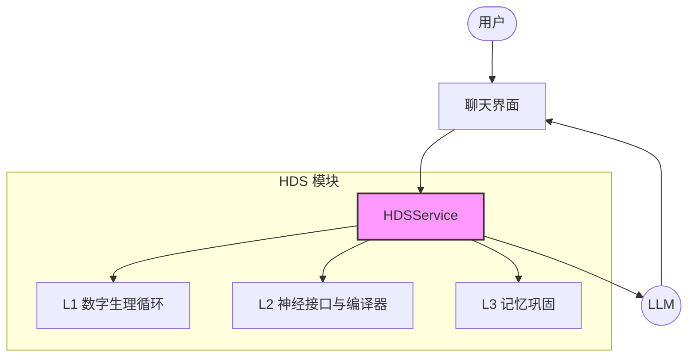

**[返回目录](../INDEX.md)** | **[返回本章](./README.md)** | **[上一节](./01.md)** | **[下一节](./03.md)**

# 08.2 对话系统集成
### 2.1 系统架构

#### 2.1.1 集成架构图

#### 2.1.2 数据流

1. 用户输入 → 聊天界面
2. 聊天界面 → HDS.observe()
3. HDS → L1 更新状态
4. HDS → L2 编译控制输出
5. HDS → LLM（控制输出）
6. LLM → 生成响应
7. 响应 → 用户
8. HDS → L3 记录日志

### 2.2 动态调节对话

#### 2.2.1 语气调节

HDS 根据当前状态动态调节对话语气：

| 状态 | 语气 | 表现 |
| :--- | :--- | :--- |
| $H_{social} < \tau_{\mathrm{social,low}}$ | 温暖、主动 | 更愿意展开话题、更主动提问 |
| $H_{social} > \tau_{\mathrm{social,high}}$ | 冷淡、独立 | 更简洁回应、更少主动 |
| $H_{energy} < \tau_{\mathrm{energy,low}}$ | 简洁、直接 | 更短回应、更少解释 |
| $H_{energy} > \tau_{\mathrm{energy,high}}$ | 详细、耐心 | 更长回应、更多解释 |
| \(N_{\mathrm{NE}} > \tau_{\mathrm{ne,high}}\) | 警觉、防御 | 更谨慎表达、更多边界 |
| \(N_{\mathrm{NE}} < \tau_{\mathrm{ne,low}}\) | 放松、开放 | 更随意表达、更少边界 |

**参数解释**：
- $\tau_{\mathrm{social,low}}$：社交饱腹感低阈值（符号化；不展示真实数值）
- $\tau_{\mathrm{social,high}}$：社交饱腹感高阈值（符号化；不展示真实数值）
- $\tau_{\mathrm{energy,low}}$：认知能量低阈值（符号化；不展示真实数值）
- $\tau_{\mathrm{energy,high}}$：认知能量高阈值（符号化；不展示真实数值）
- $\tau_{\mathrm{ne,low}}$：去甲肾上腺素低阈值（符号化；不展示真实数值）
- $\tau_{\mathrm{ne,high}}$：去甲肾上腺素高阈值（符号化；不展示真实数值）

#### 2.2.2 节奏调节

HDS 根据当前状态动态调节对话节奏：

| 状态 | 节奏 | 表现 |
| :--- | :--- | :--- |
| \(N_{\mathrm{DA}} > \tau_{\mathrm{da,high}}\) | 快节奏 | 更快回应、更多话题切换 |
| \(N_{\mathrm{DA}} < \tau_{\mathrm{da,low}}\) | 慢节奏 | 更慢回应、更少话题切换 |
| $H_{energy} > \tau_{\mathrm{energy,high}}$ | 持续节奏 | 更稳定回应、更少中断 |
| $H_{energy} < \tau_{\mathrm{energy,low}}$ | 间歇节奏 | 更不规律回应、更多中断 |

**参数解释**：
- $\tau_{\mathrm{da,high}}$：多巴胺高阈值（符号化）
- $\tau_{\mathrm{da,low}}$：多巴胺低阈值（符号化）
- $\tau_{\mathrm{energy,high}}$：认知能量高阈值（符号化）
- $\tau_{\mathrm{energy,low}}$：认知能量低阈值（符号化）

#### 2.2.3 深度调节

HDS 根据当前状态动态调节对话深度：

| 状态 | 深度 | 表现 |
| :--- | :--- | :--- |
| $H_{energy} > \tau_{\mathrm{energy,high}}$ | 深度对话 | 更详细解释、更多分析 |
| $H_{energy} < \tau_{\mathrm{energy,low}}$ | 浅层对话 | 更简洁回应、更少分析 |
| \(N_{\mathrm{5HT}} > \tau_{\mathrm{5ht,high}}\) | 结构化对话 | 更有条理、更多逻辑 |
| \(N_{\mathrm{5HT}} < \tau_{\mathrm{5ht,low}}\) | 自由对话 | 更随意、更多联想 |

**参数解释**：
- $\tau_{\mathrm{energy,high}}$：认知能量高阈值（符号化）
- $\tau_{\mathrm{energy,low}}$：认知能量低阈值（符号化）
- $\tau_{\mathrm{5ht,high}}$：血清素高阈值（符号化）
- $\tau_{\mathrm{5ht,low}}$：血清素低阈值（符号化）

### 2.3 用户情绪感知

#### 2.3.1 情绪识别

HDS 通过感知模块识别用户情绪：

| 情绪类型 | 触发条件 | 检测方法 |
| :--- | :--- | :--- |
| positive | 情感分数 > $\tau_{\mathrm{sent,pos}}$ | 情感分析 |
| neutral | 情感分数 ∈ [$\tau_{\mathrm{sent,neg}}$, $\tau_{\mathrm{sent,pos}}$] | 情感分析 |
| negative | 情感分数 < $\tau_{\mathrm{sent,neg}}$ | 情感分析 |
| angry | 关键词匹配 | 关键词提取 |
| sad | 关键词匹配 | 关键词提取 |
| fearful | 关键词匹配 | 关键词提取 |
| surprised | 情感分数突变 | 情感分析 |

**参数解释**：
- $\tau_{\mathrm{sent,pos}}$：情感正阈值（符号化）
- $\tau_{\mathrm{sent,neg}}$：情感负阈值（符号化）

#### 2.3.2 情绪响应

HDS 根据用户情绪调整响应策略：

| 用户情绪 | HDS 响应策略 |
| :--- | :--- |
| positive | 提升温暖度、主动性 |
| neutral | 保持当前状态 |
| negative | 提升防御性、边界力度 |
| angry | 提升防御性、降低主动性 |
| sad | 提升温暖度、降低防御性 |
| fearful | 提升防御性、降低主动性 |
| surprised | 提升好奇心、降低防御性 |

---

**[返回目录](../INDEX.md)** | **[返回本章](./README.md)** | **[上一节](./01.md)** | **[下一节](./03.md)**
